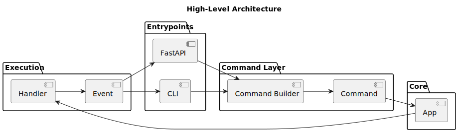

# Architecture

## Overview

The application is built around a **command-driven architecture**.

It separates:
- input (CLI / API)
- execution (App + Handlers)
- output (Events)

---

## Components

### Frontends
- CLI
- FastAPI

These are thin layers responsible only for:
- parsing input
- presenting output

---

### Command Layer

- `FrontendCommandInput`
- `build_commands()`
- `Command`

This layer converts external input into structured commands.

---

### Core (`App`)

The `App` acts as the orchestrator:

- receives commands
- resolves handlers
- executes logic
- yields events

---

### Handlers

Each command has a corresponding handler:

- encapsulates logic
- produces events
- fully decoupled from frontend

---

### Events

Events are the output abstraction:

- `EvtLog`
- `EvtProgress`
- `EvtResult`
- `EvtError`

Frontends decide how to display them.

---

## Design Principles

- Separation of concerns
- Extensibility (add commands without touching core)
- Frontend independence (CLI/API reuse same backend)
- Stream-based execution (generator pattern)
