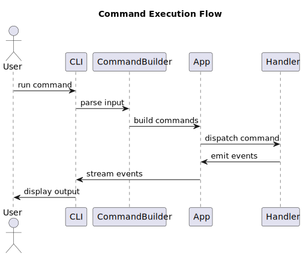

# Execution Flow

## Step-by-step

1. User triggers a command (CLI or API)
2. Input is parsed into `FrontendCommandInput`
3. Commands are built via `build_commands`
4. `App.run()` executes commands
5. Matching handler is resolved
6. Handler emits events
7. Events are returned to frontend
8. Frontend renders output

---

## Key idea

The system never returns raw values.

Everything is expressed as **events**, which allows:

- streaming output
- unified handling
- frontend flexibility
